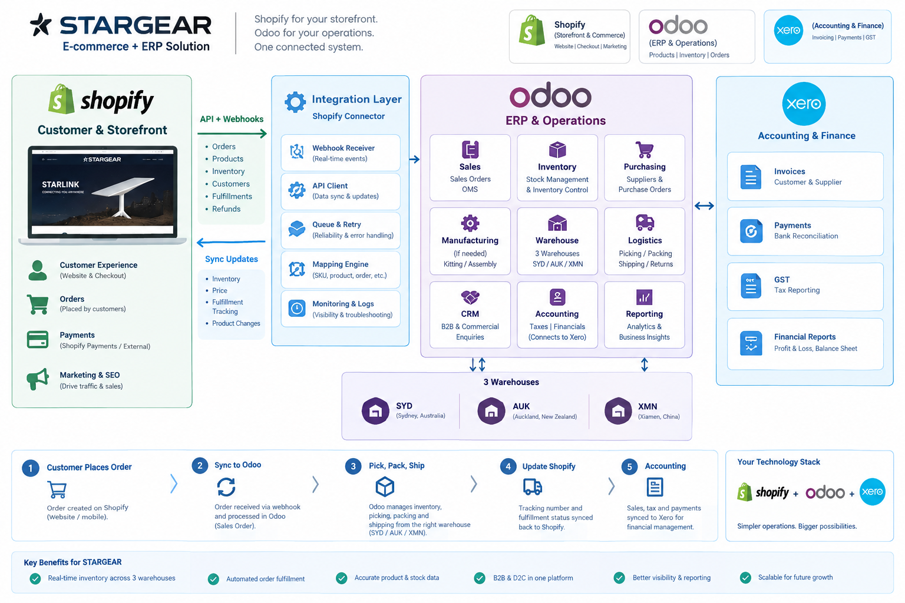

# OMS/Odoo 完整需求分析

**BRD / Functional Requirements / SRS 初稿**



| 项目 | 内容 |
|---|---|
| 适用品牌 | STARGEAR + PREMIER + SUNARMOR |
| 电商渠道 | Shopify × 2 |
| 仓库 | XMN / SYD / AUK 三仓 |
| 财务系统 | Xero × 2 |
| 用途 | Odoo Fit-Gap、实施报价、自建 OMS/WMS 方案比较 |
| 整理日期 | 2026-09-14 |

---

## 目录

1. 项目目标
2. 业务范围
3. System of Record
4. Product / SKU Management
5. Inventory Management
6. 三仓库与库存调拨
7. OMS / Sales Order
8. Warehouse Allocation
9. Purchasing
10. Supplier Management
11. Shipment / Container / Landed Cost
12. Receiving / Put Away / WMS
13. Stocktake
14. Returns / Refunds
15. Shopify Integration
16. Xero Integration
17. Multi-company / Brand
18. Tax / GST
19. Multi-currency
20. Users / Roles / Permissions
21. Audit / Security / Reliability
22. Reporting / BI
23. Dashboard
24. Odoo 19 方案
25. 自建 OMS/WMS 方案
26. Odoo vs 自建 OMS/WMS
27. 实施路线
28. UAT / 验收标准
29. Fit-Gap 标记
30. 最终建议
- 附录 A — 推荐业务架构
- 附录 B — 核心订单流
- 附录 C — 核心供应链流
- 附录 D — Odoo 官方 Shopify Connector（v19.0）
- 附录 E — Shopify 配送与退货管理（官方文档）
- 附录 F — Odoo 销售退货与退款（官方文档）
- 附录 G — Odoo 导航入门
- 附录 H — Odoo 库存基础：收货与存储
- 附录 I — 第三方连接器对比：TechMarbles Shopify Connector
- 参考链接汇总

---

## 1. 项目目标

- 建立统一业务运营平台，连接 Shopify、订单、库存、仓库、采购、供应链和 Xero。
- 建议系统边界：
  - Shopify = Commerce
  - Odoo/OMS = Operations & Inventory
  - Xero = Financial Accounting
- 核心数据流：Shopify → OMS/Odoo → Xero。
- 避免多个系统同时作为同一类数据的主数据源。

---

## 2. 业务范围

- STARGEAR：Starlink accessories。
- PREMIER：commercial consumables。
- SUNARMOR：solar/battery supplies & spare parts。
- XMN：厦门采购/出口/集货。
- SYD：悉尼澳洲主配送。
- AUK：奥克兰新西兰配送。
- 渠道：STARGEAR Shopify Store、PREMIER Shopify Store。
- 财务：STARGEAR Xero、PREMIER Xero。

---

## 3. System of Record

| 系统 | 职责 | 主数据范围 |
|---|---|---|
| Shopify | Commerce | Website、Product presentation、Customer、Cart、Checkout、Payment、Online Order、Promotion |
| Odoo/OMS | Operations & Inventory | Inventory、Warehouse、Purchase、Supplier、Allocation、Picking、Packing、Transfer、Returns、Landed Cost |
| Xero | Financial Accounting | General Ledger、AP、AR、GST、Bank、Payment、Financial Reporting |

---

## 4. Product / SKU Management

- Product 字段：SKU、Name、Brand、Category、Description、Barcode、HS Code、Country of Origin、Weight、Dimensions、Supplier、Cost、Price、Currency、Tax Code、Active/Inactive。
- Variant 必须拥有独立 SKU、Barcode、Weight、Cost、Price、Inventory。
- SKU 是 Shopify、OMS/Odoo、Xero 之间主要业务 Key；不能依赖商品名称。

---

## 5. Inventory Management

- 每个 SKU × Warehouse 维护：
  - OnHand
  - Reserved
  - Available
  - InTransit
  - Damaged
  - Quarantine
  - Returned
- 建议公式：

```text
Available = OnHand - Reserved - Damaged - Quarantine
```

- 所有库存调整必须记录：User、Timestamp、OldValue、NewValue、Reason。

---

## 6. 三仓库与库存调拨

- 支持路线：
  - XMN → SYD
  - XMN → AUK
  - SYD ↔ AUK
- Transfer 字段：Number、From、To、SKU、Qty、Requested Date、Ship Date、ETA、Actual Arrival、Status。
- 状态：

```text
Draft → Approved → Picking → Shipped → In Transit → Received → Completed
```

- 支持 Cancelled。
- 货物离开源仓减少 OnHand，目标仓增加 InTransit；实际收货后转为 OnHand。

---

## 7. OMS / Sales Order

- 流程：

```text
Shopify Order → Validate → Allocation → Warehouse Selection → Pick → Pack → Ship → Tracking → Shopify Fulfillment
```

- 状态：New、Confirmed、Allocated、Picking、Packed、PartiallyShipped、Shipped、Delivered、Cancelled、Returned、Refunded、Closed。
- 必须支持订单拆分、部分发货、Backorder、取消、退货和退款。
- 一个订单可以产生多个 Shipment，但必须保留与原 Shopify Order 的关联。

---

## 8. Warehouse Allocation

- 根据客户地区、库存可用量、仓库优先级和物流规则决定发货仓。
- 建议 SYD/AUK 优先；XMN Direct Ship 作为可配置规则。

---

## 9. Purchasing

- 流程：

```text
Purchase Request → RFQ → Approval → Purchase Order → Supplier Confirmation → Shipment → Receiving → Invoice
```

- PO 字段：Supplier、Supplier SKU、Internal SKU、Qty、Unit Price、Currency、Expected Delivery、Warehouse、Incoterm、Payment Term、MOQ、Lead Time、Notes。
- 审批阈值应可配置；示例：
  - < A$1k
  - A$1–5k
  - A$5–20k
  - > A$20k

---

## 10. Supplier Management

- Supplier 字段：Contact、Country、Currency、Payment Terms、Lead Time、MOQ、Incoterm、Supplier SKU、Unit Cost、Historical Cost。
- 支持 Supplier × SKU，保存不同供应商价格、MOQ、Lead Time 和历史采购成本。

---

## 11. Shipment / Container / Landed Cost

- Shipment 字段：Number、Supplier、Warehouse、Container Number、Booking Number、ETD、ETA、Actual Arrival、Forwarder、Incoterm、Freight、Duty、Customs、Status。
- Landed Cost 公式：

```text
Landed Cost = Product Cost + Freight + Insurance + Duty + Customs + Port Fee + Broker + Other Charges
```

- 利润分析应优先使用 Landed Cost，而不仅仅是 Supplier Cost。

---

## 12. Receiving / Put Away / WMS

- 流程：

```text
PO → Expected Receipt → Scan SKU → Quantity Check → Quality Check → Put Away → Inventory Update
```

- 支持部分收货，例如 Expected 100、Received 98、Damaged 2。
- 支持 Receiving、Put Away、Picking、Packing、Dispatch、Stocktake、Adjustment、Transfer、Return。
- 可扩展 Bin Location，例如：

```text
SYD/A01/A01-01/A01-01-03
```

- 支持 Barcode / QR Code。

---

## 13. Stocktake

- 流程：

```text
Stocktake → Snapshot/Freeze → Count → Variance → Approval → Adjustment
```

- 记录：System Qty、Physical Qty、Variance、Reason、Counter、Timestamp、Approver。

---

## 14. Returns / Refunds

- 流程：

```text
Shopify Return → Return Authorisation → Warehouse Receive → Inspection → Good / Damaged / Quarantine
```

- 支持 Full Refund、Partial Refund、Shipping Refund、Product Refund。
- 必须关联 Order、Invoice、Credit Note、Xero。

---

## 15. Shopify Integration

- Shopify → Odoo/OMS：
  - Products
  - Customers
  - Orders
  - Payments
  - Returns
  - Refunds
- Odoo/OMS → Shopify：
  - Inventory
  - Fulfillment
  - Tracking
  - 必要的 Product updates
- 两个 Store 分别配置：
  - Store ID
  - Credentials
  - Product / Inventory Mapping
  - Order Mapping
  - Tax Mapping
  - Warehouse Mapping
- 必须验证：
  - 同步延迟
  - 重复订单
  - 库存冲突
  - 失败重试
  - webhook / cron 机制

---

## 16. Xero Integration

- 建议 Shopify 不直接连接 Xero，而采用：

```text
Shopify → Odoo/OMS → Xero
```

- OMS/Odoo → Xero：
  - Customer Invoice
  - Credit Note
  - Supplier Bill
  - Payment
- 可按需要回传：
  - Payment Status
  - Contacts
  - Accounts
  - Tax
- 必须验证实际 Xero Connector 的版本、同步对象、多公司、失败处理和费用。

---

## 17. Multi-company / Brand

- 只有独立 Legal Entity 才建立 Company。
- Brand / Business Unit 不应无理由拆成 Company。
- 如果 SUNARMOR 是独立法律实体，建立独立 Company。
- 如果 SUNARMOR 只是品牌，则使用 Brand / Business Unit / Analytic Dimension。

---

## 18. Tax / GST

- 澳洲：
  - GST taxable
  - GST-free
  - Export
  - Input Tax Credit
  - BAS
  - Tax Mapping
- NZ：
  - NZ GST
  - NZ sales
  - NZ purchases
  - Import
  - Export
  - FX
- 税务配置应以实际注册情况及 Odoo/Xero 本地化能力为准。

---

## 19. Multi-currency

- 建议至少支持：AUD、NZD、USD、CNY。
- 每笔交易保存：
  - Transaction Currency
  - Exchange Rate
  - Base Currency
  - Transaction Date
- 历史交易不能随今日汇率变化而重算。

---

## 20. Users / Roles / Permissions

| 用户 | 角色 |
|---|---|
| Vincent | Owner / SuperAdmin / Finance |
| Bessie | Sales / Shopify |
| Cassie | Sales |
| Asher | Warehouse Manager |
| Johnny | Sales + Warehouse |
| Craig | Admin / IT / Integration / Reporting |

- 权限应按模块、Company、Warehouse、Store、操作类型细分。
- 尤其限制：
  - Inventory Adjustment
  - Refund
  - PO Approval
  - Accounting

---

## 21. Audit / Security / Reliability

- 重要操作记录：User、Timestamp、Action、Old Value、New Value、Reason。
- 安全：
  - MFA
  - RBAC
  - OAuth
  - Encryption
  - Secrets Management
  - Audit Log
  - API Access Control
- Integration：
  - Authentication
  - Authorization
  - Idempotency
  - Retry
  - Dead Letter Queue
  - Logging
  - Monitoring
- 建议：
  - Availability 99.9%
  - 数据库 Daily Backup + Point-in-Time Recovery
  - 初始目标 RPO ≤ 1 hour、RTO ≤ 4 hours

---

## 22. Reporting / BI

- Sales：按 Brand、SKU、Customer、Shopify Store、Warehouse、Country。
- Inventory：On Hand、Available、Reserved、In Transit、Slow Moving、Dead Stock、Inventory Valuation。
- Purchasing：Open PO、Supplier Performance、Purchase Cost、Lead Time、MOQ。
- Warehouse：Pending Orders、Pick/Pack Performance、Stock Variance。
- Profitability：

```text
Sales - Product/Landed Cost - Freight - Fees = Gross Margin
```

---

## 23. Dashboard

- Management Dashboard：
  - Sales
  - Orders
  - Inventory Value
  - Gross Margin
  - SYD/AUK/XMN Inventory
  - Open PO
  - In Transit
  - Backorders
  - Returns
- Warehouse Dashboard：
  - Pending Pick
  - Pending Pack
  - Dispatch
  - Stock Variance
- Purchasing Dashboard：
  - Open PO
  - ETA
  - Supplier Lead Time
  - Cost Trend

---

## 24. Odoo 19 方案

- Odoo 19 作为运营核心，Shopify 作为 Commerce，Xero 作为 Finance。
- 标准 Odoo 承担：
  - Sales
  - Inventory
  - Purchase
  - Warehouse
  - Supplier
- 特殊业务用 Custom Modules。
- 重点 Fit-Gap：
  - Shopify 两店
  - 库存同步实时性
  - 三仓库 / Transit
  - Allocation
  - Returns / Refunds
  - Xero Connector
  - AU/NZ GST
  - Landed Cost
  - Container / Shipment
  - Barcode
  - 审批

---

## 25. 自建 OMS/WMS 方案

- 架构：

```text
Shopify → API Gateway → OMS API → PostgreSQL
```

- 异步：SQS
- Cache：Redis
- 文件/备份：S3
- 部署：ECS/Fargate 或 Lambda
- 财务：Xero API
- 建议技术栈：
  - React / Next.js
  - Python FastAPI
  - PostgreSQL
  - AWS SQS
  - Redis
  - S3
  - ECS/Fargate
  - CloudWatch
  - Secrets Manager
- 自建方案适合高度定制、实时事件驱动和长期产品化，但需要承担税务、财务、审计、运维和升级成本。

---

## 26. Odoo vs 自建 OMS/WMS

| 维度 | Odoo | 自建 OMS |
|---|---|---|
| Shopify | 9/10 | 10/10 |
| Inventory | 10/10 | 10/10 |
| Purchasing | 10/10 | 10/10 |
| WMS | 9/10 | 10/10 |
| Xero | 7/10 | 9/10 |
| AU/NZ GST | 10/10 | 5/10 |
| Accounting | 10/10 | 3/10 |
| Custom Logic | 8/10 | 10/10 |
| Time-to-Market | 9/10 | 5/10 |

---

## 27. 实施路线

| 阶段 | 内容 |
|---|---|
| Phase 1 Foundation | Company、Brand、Product、SKU、Supplier、Customer、Warehouse、Location、Tax、Currency；Shopify 两店；三仓库存、Reserved、Available、Transfer |
| Phase 2 Warehouse + Purchasing | Receiving、Put Away、Picking、Packing、Dispatch、Barcode、Stocktake、Purchase Request、RFQ、PO、Approval、Supplier |
| Phase 3 International Supply Chain | Shipment、Container、ETA、Freight、Customs、Duty、Landed Cost、In Transit |
| Phase 4 Finance | Invoice、Credit Note、Supplier Bill、Payment、GST、Reconciliation |
| Phase 5 Analytics | Data Warehouse、Databricks/SQL、Power BI、Forecast、Replenishment、Dead Stock |

---

## 28. UAT / 验收标准

- Order：
  - Shopify Order 自动进入
  - 不重复
  - 可取消
  - 拆单
  - 部分发货
  - Backorder
- Inventory：
  - 三仓
  - Reserved
  - Available
  - Transfer
  - In Transit 数量正确
- Warehouse：
  - Receiving
  - Picking
  - Packing
  - Dispatch
  - Stocktake 全流程完成
- Purchase：
  - PO
  - Approval
  - Receiving
  - Partial Receiving
  - Supplier Invoice
- Shopify：
  - Order
  - Inventory
  - Fulfillment
  - Tracking
  - Return
  - Refund
- Xero：
  - Invoice
  - Credit Note
  - Bill
  - Payment
  - GST 正确同步

---

## 29. Fit-Gap 标记

- O = Odoo Standard
- C = Configuration
- M = Custom Module
- I = Integration
- N = Not Supported

建议拿本需求逐项询问 Odoo 实施商，并要求每一项给出 Standard / Configuration / Custom 的明确结论和报价。

优先验证：

- Shopify 两店
- 库存实时性
- 三仓 Transit
- Allocation
- Returns / Refunds
- Xero
- 多公司
- AU/NZ GST
- Landed Cost
- Container / Shipment
- Barcode
- 审批

---

## 30. 最终建议

- 当前最合理方案：以 Odoo 19 为基线做 Fit-Gap，采用 Odoo + Custom Modules，而不是一开始 100% 自建 ERP。
- 标准业务交给 Odoo；真正特殊、形成竞争力的流程再开发。
- 只有当核心业务流程约 20–30% 以上需要深度定制，且实时事件驱动成为关键要求时，再认真考虑独立 OMS/WMS。

---

# 附录

## 附录 A — 推荐业务架构

```text
Shopify STARGEAR + Shopify PREMIER
        ↓
Odoo / OMS
        ↓
XMN / SYD / AUK
        ↓
Xero STARGEAR + Xero PREMIER
```

- Shopify 负责 Commerce。
- Odoo/OMS 负责 Operations。
- Xero 负责 Finance。

---

## 附录 B — 核心订单流

```text
Customer
→ Shopify
→ Order
→ OMS/Odoo
→ Inventory Allocation
→ SYD/AUK
→ Pick
→ Pack
→ Ship
→ Tracking
→ Shopify Fulfillment
→ Xero Accounting
```

---

## 附录 C — 核心供应链流

```text
Supplier
→ Purchase Order
→ XMN
→ Container
→ In Transit
→ SYD/AUK
→ Available
→ Shopify
```

---

## 附录 D — Odoo 官方 Shopify Connector（v19.0）

**来源：**  
https://www.odoo.com/documentation/19.0/applications/sales/sales/shopify_connector.html

**支持同步的数据：**

| 数据 | 方向 |
|---|---|
| Orders | Shopify → Odoo |
| Products | Shopify → Odoo |
| Inventory | 双向 |
| Fulfillments / Deliveries | 双向 |
| Returns | Shopify → Odoo |
| Refunds / Credit Notes | Shopify → Odoo |
| Invoices & Payments | Odoo 自动创建 |
| Customers | Shopify → Odoo |

**关键限制与同步机制：**

- 官方连接器不执行实时同步，不依赖 Webhook，全部通过 Scheduled Actions（cron）定期运行。
- 默认同步频率：订单每 10 分钟；库存（Odoo → Shopify）每次拉取订单后推送；在 Odoo 处理的发货每 10 分钟。
- 从 Shopify 拉取库存通常仅在首次设置连接器或修正数据不一致时需要，使用账户配置中的 “Fetch Inventory” 按钮手动触发。

**配送处理模式对退货同步的影响：**

- **Deliveries handled in Odoo：** Shopify 发起的退货不会自动同步，需在 Odoo 中手动处理。
- **Deliveries handled in Shopify：** Shopify 发起的退货会自动同步到 Odoo。

**对本次 Fit-Gap 的启示：**

如果业务要求“库存实时性”或“退货自动回流”，官方连接器的 cron 机制（10 分钟间隔）可能不满足，需评估 TechMarbles 等第三方连接器的实时同步能力，或规划自定义 Webhook 开发。

---

## 附录 E — Shopify 配送与退货管理（官方文档）

**来源：**  
https://www.odoo.com/documentation/19.0/applications/sales/sales/shopify_connector/fulfillment.html

| 配置项 | Deliveries handled in Odoo | Deliveries handled in Shopify |
|---|---|---|
| 适用场景 | 仓库团队已在 Odoo 中运营 | 订单完全在 Shopify 或第三方物流中履约 |
| 发货单创建 | 订单同步时自动创建 Ready 状态的仓库发货单 | 自动为 Unfulfilled 订单创建 Ready 状态的仓库发货单 |
| 发货验证 | 用户在 Odoo 中点击 Validate，每 10 分钟推送至 Shopify | 发货在 Shopify 完成后，承运人、追踪号和数量拉回 Odoo |
| 退货处理 | Shopify 发起的退货不自动同步，需手动处理 | Shopify 发起的退货自动同步到 Odoo |
| 拆分发货 | 支持，可多次发货 | 完全支持，可同步多地点、多承运人发货 |

**拆分发货支持：**

官方连接器完全支持拆分发货，可为同一订单创建多个 Fulfillment，包括不同地点发货、同一地点多次发货、不同承运人发货。

**对本次 Fit-Gap 的启示：**

- 三仓库（XMN/SYD/AUK）场景下，需明确 “Delivery Handled On” 的统一策略。
- 若 SYD/AUK 在 Odoo 中处理发货、XMN Direct Ship 在 Shopify 侧处理，则退货同步路径会因模式不同而产生分裂，需在设计中明确规则。
- 拆分发货是本次需求的硬性要求（第 7 节），官方连接器已声明支持，Fit-Gap 中可标记为 **O（Odoo Standard）**。

---

## 附录 F — Odoo 销售退货与退款（官方文档）

**来源：**  
https://www.odoo.com/documentation/19.0/applications/sales/sales/products_prices/returns.html

### 开票前退货（Before Invoicing）

- 使用 **Reverse Transfers** 完成退货。前提是 Inventory 应用已安装。
- 流程：销售订单 → Delivery smart button → 已验证的发货单 → 点击 Return → 调整数量 → 确认。
- 系统生成新的入库仓库操作，仓库团队验证后，原销售订单的 Delivered 数量自动更新为“初始发货量 − 退货量”。
- 后续开票时，客户仅收到其保留商品的发票。

### 开票后退货（After Invoicing）

- 已验证或已发送的发票不能直接修改，需 **Reverse Transfers + Credit Notes** 配合完成。
- 流程：销售订单 → Delivery → Return（同开票前）→ 仓库验证入库后，Delivered 数量更新。
- 退款：从销售订单打开关联发票 → 点击 **Credit Note** → 填写 Reason、Journal、Reversal Date → 点击 Reverse 或 Reverse and Create Invoice → 确认。
- 完成后页面顶部显示蓝色横幅，提示客户存在未分配贷项，可将其分配给原发票以标记为已付款。

**对本次 Fit-Gap 的启示：**

- 第 14 节要求“关联 Order、Invoice、Credit Note、Xero”。
- Odoo 原生的 Reverse Transfer + Credit Note 机制可覆盖“仓库退货 → 财务贷项”链路，但 **Credit Note 同步至 Xero** 取决于 Xero Connector 的能力，需单独验证。
- “Good / Damaged / Quarantine” 的分类检验不在标准退货流程中直接体现，可能需要 Custom Module 或配置额外的质检步骤。

---

## 附录 G — Odoo 导航入门

**来源：**  
https://www.youtube.com/watch?v=NoxYrnnHgfk

**用途：**

- 作为团队（Vincent、Bessie、Cassie、Asher、Johnny、Craig）的入职培训基础资源。
- 覆盖应用菜单访问、模块搜索与安装、基本界面导航。
- 建议纳入 Phase 1 Foundation 的用户启用计划中，在配置 Company/Brand/Product/SKU 之前完成全员基础操作培训。

---

## 附录 H — Odoo 库存基础：收货与存储

**来源：**  
https://www.youtube.com/watch?v=0r575dWbkMk&list=PL1-aSABtP6ACBCPEZqo3sGGK48sP3xS4U

**覆盖内容：**

- 产品与库位的设置，用于在 Odoo Inventory 中收货和存储物品。
- 属于 Inventory 基础系列，该系列还涵盖补货、追溯、仓库调拨、产品预留、包装、日常操作等。

**对本次实施的关联：**

- 直接支撑第 12 节 Receiving / Put Away / WMS 的基础配置培训。
- 建议 Asher（Warehouse Manager）与 Johnny（Sales + Warehouse）在 Phase 2 开始前完成该系列学习，作为 **Put Away、Bin Location、Barcode** 配置的操作前提。

---

## 附录 I — 第三方连接器对比：TechMarbles Shopify Connector

**参考来源：**

- YouTube 视频：Odoo Shopify Integration by TechMarbles  
  https://www.youtube.com/watch?v=2-yP6MhhmLc
- Shopify App Store：  
  https://apps.shopify.com/odoo-integrator
- Odoo Apps Store：  
  https://apps.odoo.com/apps/modules/18.0/techmarbles_shopify_connector

| 维度 | Odoo 官方 Connector | TechMarbles Connector |
|---|---|---|
| 同步机制 | Cron（每 10 分钟） | 声称“实时同步” |
| 库存多地点 | 需验证 | 明确支持多地点库存同步 |
| 历史数据导入 | 不明确 | 支持批量历史订单/产品/客户导入 |
| 废弃购物车 | 不支持 | 可推送至 Odoo CRM 作为销售线索 |
| 定价 | 官方内置 | 基础计划 $30/月 或 $300/年；Odoo Apps Store 显示 from $35/month |
| Odoo 版本 | 19.0 原生 | 16/17/18/19+，支持 Odoo Online、Odoo.sh、自托管 |
| 数据经过第三方云 | 否 | 是，数据经 TechMarbles 云同步服务处理 |

**社区反馈（来自 Shopify App Store 评论摘录）：**

- 有用户反馈 TechMarbles 团队对其部分发货同步需求响应迅速，并主动开发了所需功能。
- 有用户使用其完成 PayPal、Klarna 等支付方式映射等复杂配置。

**对本次 Fit-Gap 的建议：**

如果第 15 节要求的“同步延迟”验证结果指向 **10 分钟 cron 不可接受**，TechMarbles 可作为备选方案之一纳入比较，但必须验证：

1. 三仓库（XMN/SYD/AUK）场景下多地点库存同步的准确性；
2. 退货/退款是否自动回流，以及是否与官方连接器在 “Deliveries handled in Shopify” 模式下的行为一致；
3. 数据经过第三方云同步服务的安全与合规是否满足第 21 节的 Audit/Security 要求（OAuth、加密、Secrets Management、API Access Control）。

建议在 Fit-Gap 阶段将 **官方 Connector 与 TechMarbles Connector 并行验证**，以 UAT 场景中的“库存冲突”“重复订单”“失败重试”为测试用例，用实际同步延迟和错误率做决策依据。

---

## 参考链接汇总

- Odoo Shopify Connector：  
  https://www.odoo.com/documentation/19.0/applications/sales/sales/shopify_connector.html
- Shopify delivery and return management：  
  https://www.odoo.com/documentation/19.0/applications/sales/sales/shopify_connector/fulfillment.html
- Odoo Returns：  
  https://www.odoo.com/documentation/19.0/applications/sales/sales/products_prices/returns.html
- TechMarbles Shopify Integration：  
  https://www.youtube.com/watch?v=2-yP6MhhmLc
- Navigate in Odoo：  
  https://www.youtube.com/watch?v=NoxYrnnHgfk
- Inventory Basics: Receive and Store Stock：  
  https://www.youtube.com/watch?v=0r575dWbkMk&list=PL1-aSABtP6ACBCPEZqo3sGGK48sP3xS4U

---

> 注：本文档根据公开资料与需求分析初稿整理，实施前请以 Odoo 官方文档、Xero/Shopify 官方说明及供应商最终确认为准。